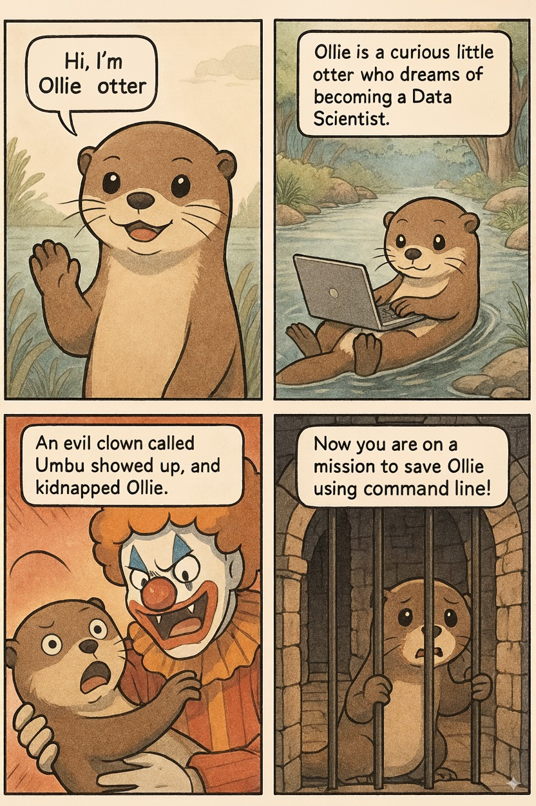

# DSCI 525 Tutorial 1: Linux Command Line in Amazon Web Services (AWS) Elastic Compute Cloud (EC2) Instances

Sky (Kehan) Sheng, Master of Data Science (MDS) TA for DSCI 525

## Overview
This repository contains materials for the "Linux command line in AWS EC2 instance" tutorial held on April 1, 2025, as part of the MDS DSCI 525 course (web and cloud computing). The tutorial covers fundamental Linux commands, file system navigation, and practical exercises using AWS EC2 instances. This repository also includes AWS cheatsheet on how to set up EC2 instances, the Littlest Jupyter Hub, adding users and other commonly used operations.

---

## 🦦 Mission: Rescue Ollie the Otter!

### Meet Ollie the Otter

Ollie is a curious little otter who dreams of becoming a **Data Scientist**. She lives peacefully by the ocean, spending her evenings on her otter-sized laptop learning **Linux** so she can:

- Learn from fishes, clams, oysters who know all about Linux command
- Organize her **fish collection**,
- Clean up her **messy snack drawer**.

---

### 🚨 Plot Twist: Ollie Has Been Captured!

But something went wrong.

A clown — a mysterious entity known only as **`Umbu`** — showed up today in Ollie's home, kidnapped her and **locked her in a hidden dungeon directory** and taken over her home by the ocean.

Now it's up to **you**, the command-line hero, to **rescue Ollie** and restore order to her filesystem.

Before Ollie was captured into the dungeon, she left one last message for us 🌊 **"Ocean knows it all..."** 🌊

---

### 🎯 Your Mission

Using only **Linux commands**, you will:

- Find secrets in the **ocean**
- Navigate through suspicious directories,
- Identify suspicious files planted by **Umbu**,
- And **unlock the dungeon** to free her.

---

### 💡 Can You Save Ollie?

The command line is your map.  
The terminal is your sword.  
And Ollie’s future as a Data Scientist depends on **your Linux skills**.

Let the mission begin.

---

## 📁 Repository Structure
- **`agenda_answer_to_activity.md`:** Agenda and activites (with answer key) planned for this 1-hour tutorial.
- **`aws_cheatsheet/`:** Step-by-step guides for working with AWS EC2 instances, key pairs, user management, and JupyterHub.
- **`linux_cheatsheet/`:** Basic Linux command line instructions.
- **`images/`:** Visuals used throughout the guides to support understanding.
- **`story_of_otter/`:** A playful, story-based section featuring Ollie the otter, designed to teach Linux commands through an engaging narrative. Includes thematic subfolders like the `ocean`, `clown_dungeon` and `home_of_ollie`.

This structure supports both technical instruction and creative exploration to make learning more accessible and fun.

## License
This materials is licensed under the [Creative Commons](LICENSE).

## Acknowledgement
The materials in `aws_cheatsheet` are my note adopted from the [lecture video](https://youtu.be/9ECsi3C4-eo?si=ovEB7ihdTf5aQq_X) and [DSCI 525 lecture note](https://pages.github.ubc.ca/MDS-2024-25/DSCI_525_web-cloud-comp_students/lectures/lecture3.html#aws-lab-setup) created by Dr. Gittu George & Dr. Ilya Musabirov. I've orgnaized them here for easy access during the tutorial.

## Contact
For questions or feedback, please contact [Sky Sheng] at [skysheng7@gmail.com]
