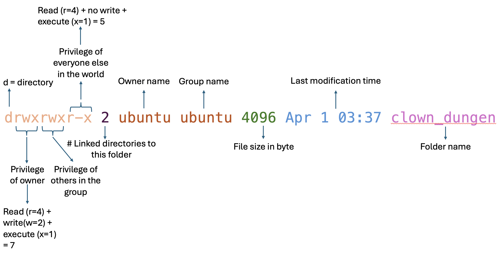

# 👩‍🏫Tutorial Agenda

------------------------------------------------------------------------
## 0. Github repository share

-   Most things we need in this tutorial are on this GitHub repository 

------------------------------------------------------------------------

## 1. ✅ Check-in: Who Has Already Created an EC2 Instance?

-   Please raise your hand if you've **already created an EC2 instance**.
-   If most people have not, I will walk everyone through this process together (*10 min*).

### Before Setting Up EC2 Instance:

-   Who has already created their **AWS Lab account**?
-   Who has already **set up AWS CLI**?

------------------------------------------------------------------------

## 2. Start AWS lab EC2 Instance

(*5 min*)

-   Click "start lab" on your AWS Canvas
-   Click the AWS after the green light is on
-   Click EC2 > "Instances" > click on one of the hyperlinks under "Instance ID" > "Instance state" > "start Instance"

------------------------------------------------------------------------

## 3. 🔑 How Does Authentication Work in AWS EC2?

(*5 min*)

**📍Q: why do we don't want to use passwords to login EC2?**

-   In AWS EC2, we don’t use passwords for login, passwords are very
    weak and easy to break in.
-   Instead, we use a key-based authentication system: Key pair
    (including a public key and a private key).

### 🗝️ Public Key & Private Key – What’s the Difference?

- 🔐 **Public key** is like a **lock** you can share with others freely. Public key can encrypt a message.
- 🔑 **Private key** is the **key** that can open that lock — keep it secure and secret! Private key can decrypt the message encrypted by the public key.

Public keys can be shared freely; private keys should be stored safely and securely. 

- Note: you can use this unique key pair (lock & key set) anywhere, this is not restricted to EC2 instance, you can use the lock to lock anything!

------------------------------------------------------------------------

## 4. 🛠️ How to Create a Key-Pair

(*10 min*)

We’ll go over this using [ssh key pair cheatsheet](aws_cheatsheet/02-ssh_key_pair.md)

-   I would not have time to go through [how to add new user to EC2 instance](aws_cheatsheet/03-ec2_add_new_user.md), but you can go through the note yourself. You will need to copy the public key we extracted and add it into your EC2 instance. 

-   **Note**: For milestone 2, don't need to do this, just add user from JupyterHub web interface. See [how to add new user to jupyterHub](aws_cheatsheet/04-littest_jupyterHub.md)!

------------------------------------------------------------------------

## 5. 🔐 What is SSH?

(*2 min*)

**📍Q: what is SSH?**

-   **SSH (Secure Shell)** allows you to securely access a **remote computer**.
    -   The **remote computer** is your **server**
    -   Your **local machine** is the **client**

See [key pair comics](aws_cheatsheet/00-background_knowledge.md)

------------------------------------------------------------------------

## 6. SSH into EC2 instance

(*5 min*)

-   **Note**: We will be using the key pair you saved when you set up your EC2 instance, this is not the key pair we just created!

We’ll go over this using [Logging into EC2 Instance as Admin/Host](aws_cheatsheet/01-ec2_instance_setup.md)

-   **Note**: Show 2 ways of accessing folder path on macOS

### 📌 Example:

``` bash
ssh -i <path_to_private_key.pem> <username>@<ec2_hostname>
```

**📍Q: what does `-i` mean?**

-   `-i` means identity file, it says "hey, loook here, this is my private key!"

------------------------------------------------------------------------

## 7. Save Ollie the Otter Using Linux Command

After logging into EC2 instance


### 7.1 🏠 Understanding Your Location

**📍Q: What does `~` mean?**

-   `~` = home directory

Now let's clone the github repository to the EC2 instance using `git clone`. 

In the next exercise, we will be walking into the world of Ollie. Ollie is a curious little otter who dreams of becoming a Data Scientist. She lives peacefully by the ocean, spending her evenings on her otter-sized laptop learning Linux. But something went wrong.

A clown — a mysterious entity known only as `Umbu` — showed up today in Ollie's home, kidnapped her and locked her in a hidden dungeon directory and taken over her home by the ocean.

Now it's up to you, the command-line hero, to rescue Ollie and restore order to her filesystem. Before Ollie was captured into the dungeon, she left one last message for us **"Ocean knows it all..."**

Let's run `cd linux_command_in_aws_ec2/story_of_otter` to walk into Ollie's world! 

**📍Q: How can I confirm where am I? which command can print my current work directory?**

-   `pwd`: present working directory

**📍Q: How can I know what are the contents in my current folder?**

-   `ls`: list directory content

**📍Q: What does `-l` mean?**

-   `ls -l` : list all directories in long format (with details about each file/folder)

e.g., output like this:
```bash
total 12
drwxrwxr-x 2 ubuntu ubuntu 4096 Apr  1 03:37 clown_dungen
drwxrwxr-x 3 ubuntu ubuntu 4096 Apr  1 03:37 home_of_ollie
drwxrwxr-x 2 ubuntu ubuntu 4096 Apr  1 04:07 ocean
```



- **Explaination**
    -   Total 12 means it’s using about 12 KB of disk space
    -   d means it’s a directory
    -   rwx = read, write, execute > for the owner of this folder, and others in the same group
    -   r-x = read, not write, execute > for the the rest of the world
    -   2 for `ocean` folder means the total number of directory linked to this directory (including . and ..; not including files)
    -   First `ubuntu` is referring to owner of the directory, second is group the directory belongs to, the last is the name of the directory (e.g., `ocean`)
    -   4096 means size, this is 4096 bytes
    -   Last modification time is April 1, 3:37

-   `ls -lt`: list all directories in long format + sort by time (newest first)
-   `ls -ltr`: list all directories in long format + sort by time in reversed order (oldest first), 
-   `ls -ltrh`: list all directories in long format + sort by time in reversed order,in a human readable way


### 7.2 🌊 Enter the Ocean

Now let's take a look at the ocean, what's in the ocean? 
-   `cd ocean`
-   `ls -l` to see what are in the ocean

**📍Q: How many fish do we have in total?**

-   `find . -name "*fish*"` to find all the files whose name contains `fish`
-   `find . -name "*fish* -a"` to find all the files whose name contains `fish`, including hidden ones!
-   `ls -a` can also see all files including hidden links, there is a hidden fish!


### 7.3 🧠 Peeking into a Fish’s Mind

**📍Q: What does the fish know? How to take a peek into fish's mind (aka fish_cd.txt's file)**

-   `head fish_cd.txt` prints out the first 10 lines in the file
-   `tail fish_cd.txt` prints out the last 10 lines in the file

**📍Q: How to print out everything fish_cd has to say?**

-   `cat fish_cd.txt` prints out the entire file

Every fish, and shell fish in the ocean knows some secrets about Linux command lines, you can go through the files on your own. 


### 7.4 ✍️ Editing Fish Files

Seems like fish_cd swam too far (too many "swim..." in the txt file), **📍Q: how can we edit the fish_cd's text file?** 

-   `nano fish_cd.txt`: Nano is a simpler text editor: Ctrl+O to save, Ctrl+X to exit, Ctrl+K to delete entire line of text

An alternative to `nano`, more advanced file editing? 

-   `vi fish_cd.txt`: vi is a very powerful and advanced text editor. 
    -   press "i" to enable editing (i = insert), then insert whatever you want 
    -   press "esc” to save, then type “:wq” and press enter to save & quit (w = write, q = quit)
    -   to quit without saving: press "esc” to save, then type “:q!” and press enter

If you encounter a new fish called fish 700 in the future, you can create a new file for fish 700:

-   `touch fish700.txt`: Touch only create an empty file, not going to edit or add anything in it
-   `echo blue > fish700.txt`: print the world "blue" into the fish's brain
-   `echo ocean >> fish700.txt`: append the world "ocean" into the fish's brain
-   `cp fish700.txt fish800.txt`: fish 700 copying her message to fish 800


Now that we've learnt important Linux command line from the fish, clams and oyster, let's go back to the story_of_otter folder and try to save Ollie!

-   `cd ..` going back to parent folder
-   `ls -l` again to see who owns the dungen? Wow! Ubuntu is `Umbu`'s real name!!


### 7.5 🛡️ Give Ollie Her Power Back

The dungeon is magic, it only listens to its owner, well, the owner on paper. To save Ollie, we need to secretly make Ollie to be the new owner of the dungeon, and dungeon will no longer listen to Ubuntu the clown!

-   `sudo adduser ollie --disabled-password` to add ollie as a new user to our system
    -   `sudo` = super user do
    -   `--disabled-password` because we want to use key based authentication not password based

-   `sudo chown ollie:ollie clown_dungeon` to make Ollie become owner of the dungeon!
    -   `chown` = change ownership
    -   `ollie:ollie` = `owner:group`


### 7.6 🏃‍♀️ Rescue Ollie!

Now let's break into the dungeon and send Ollie back home!

-   `sudo mv clown_dungeon/ollie.txt home_of_ollie/`
    -   `mv` = move


### 7.7 🧨 Destroy the Dungeon

Let's destroy the dungeon!

-   `sudo rmdir clown_dungeon` would not work because the dungeon is not empty, there are monster and creatures in it
-   `sudo rm -rf clown_dungeon` 
    -   `-r` = recursively go through the folder
    -   `-f` = force


### 7.8 🍽️ Feed Ollie!
Ollie is starving because she had no food in the dungeon, let's catch some fish for Ollie as dinner!

-   `mkdir -p home_of_ollie/dinner/`
    -   `mkdir` = make directory
    -   `-p` = please make the parent directory of the destination directory, if the parent directory does not exist yet
-   `mv ocean/fish* home_of_ollie/dinner/`
    -   `*` = wild card, all the files that match this pattern will be moved


### 7.9 Clean Up Ollie's Snack Drawer

Let's help take the trash out for Ollie, we will remove all the shells from her snack drawer!

-   `rm *shell*.txt` or `rm -f *shell*.txt` if you don't want to be prompted for `y` in every single deletion

------------------------------------------------------------------------

## 8. Clean Up

1. `sudo deluser ollie` to delete the fake user name.
2. `exit` to end SSH session


# 🦦 Final Remark

Please **don't feed wildlife** if you ever encounter Ollie and her friends in the real world!

Feeding wildlife is not being kind to them — it is **disruptive to their natural behavior**, can **make them dependent on humans**, and may even put **their health and safety at risk**. The best way to support Ollie and her fellow animals is by **observing from a distance**, keeping their habitat clean, and respecting their wild nature.

Let’s be kind, curious, and responsible — just like Ollie the Otter would be. 💻🌿🦦